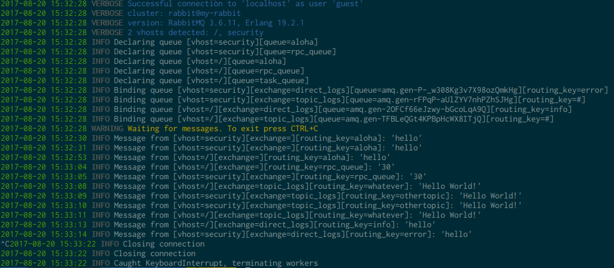

# Cottontail

A set of scripts to capture RabbitMQ messages being sent through that broker.


## Installation

### Prerequisites

* Python > 2.7.9
* a target running RabbitMQ with rabbitmq_management plugin enabled and exposed
* valid credentials

This tool uses rabbitmq-management HTTP API to request information about vhosts, exchanges and queues as the AMQP protocol does not provide a mechanism to list those components. Therefore, the tool requires valid credentials to access the API. Any user having one of those profiles will work: `administrator`, `management`, `monitoring`, and `policy`.

### Setup

```
virtualenv ve
source ./ve/bin/activate
pip install -r requirements
python main.py http://localhost:15672/ --username guest --password guest
```

You should see something along those lines:



## Operation

1. the script gather information by sending requests to rabbitmq-management HTTP API.
2. the script launch one process per vhost
3. each process establish a connection and open a channel within that vhost
4. within that channel, the process will bind to every queue and every exchange except amqp.*

For more information on how the tool attain stealth, please refer to the information below.

## Capture models

### Producer Consumer Model / RPC Model

In the producer consumer mode, our connection will just move the model towards "Work queues" as if the legitimate consumer was `worker1` and Cottontail would be `worker2`. The interesting thing here is that as soon as we receive our first message and requeue it, we will be able to capture all of them due to the round robin distribution implemented by RabbitMQ. Note that it is true for low traffic queues, it surely is different for traffic intensive queues (a message being dispatched prior to our script requeuing the previous one). Anyway, in theory, in this mode of operation, you get 100% of messages 100% of the time.

Cottontail handles RPC calls by requeuing messages with their complete metadata (`reply_to` and `correlation_id` fields), which means the RPC server will ultimately receives the request from us as if it were coming from the RPC client. Consider it 'RPC call spoofing' if you will.

### Work queues

Assuming RabbitMQ is configured by default and distribute messages to consumers in a round robin manner, you will be able to capture `len(messages)/len(consumers)-1` messages. Cottontail verify if consumers are listening for messages on the queue you just received a message from. If that is the case, it requeues the message so the next consumer receives it and your capture is transparent to them.

The less consumers there is, the more you'll be able to receive.

Note: assuming we have administrative privileges, an aggressive way to ensure we get all messages would be to disconnect all consumers but one. However, this could lead to denial of service condition if work load gets dispatched to a single node (e.g. sending emails, cropping pictures, generating PDFs, ...).

### Fanout exchange

In this capture model, we simply bind a queue to the fanout exchange while specifying a wildcard (`#`) routing key. This way we receive everything that is sent to the fanout exchange.

### Direct exchange

Direct exchanges do not support wildcard (`#`) routing keys. Therefore, we list bindings between other consumers and this direct exchange to obtain a list of routing keys. Then we bind one queue per routing key to the direct exchange. This way we are able to receive the same amount of messages as all consumers bound to this direct exchange combined.

Note: some producers might send messages with a routing key unused by currently bound consumers. Still need to thing about that scenario.


## Test setup

I used the official RabbitMQ Docker image for my tests, redirecting both RabbitMQ and rabbitmq_management HTTP API ports:

```
sudo docker run -d --hostname my-rabbit --name some-rabbit -p 15672:15672 -p 5672:5672 rabbitmq:3-management
```

If you need more information about that docker image: https://hub.docker.com/_/rabbitmq/


## Changelog

### v0.8.0

* fix issue when requeuing (see #22 and #23)

### v0.7.0

* handle permissions and access control (no AMQP connections to vhost we're not authorized to access, checks read and write permissions prior to consuming from queues and exchanges).
* better exception handling (AMQP connection is gracefully closed on interrupt signal)

### v0.6.0

* requeuing got way smarter :)

### v0.5.0

* bug fix for direct exchange bindings
* add support for Python3

### v0.4.0

* add verbose logging (show messages properties and header)
* include all message properties when requeuing
* better argument parsing and ASCII art bunny :)

### v0.3.0

* Support for AMQP connections over SSL

### v0.2.0

* Support for HTTPS connection to rabbitmq_management API.
* Fallback to dumping messages via HTTP API if AMQP listener is not reachable

### v0.1.0

Initial release

## References

* "How to silently capture RabbitMQ messages" - http://quentinkaiser.be/security/tool/2017/08/28/cottontail-release/

